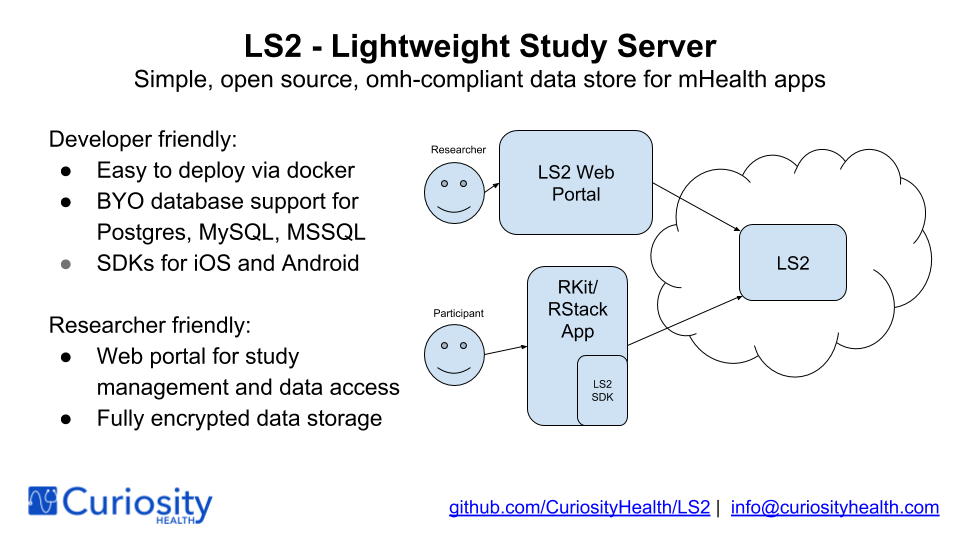

# LS2

For more information, see this [overview](https://docs.google.com/presentation/d/1UqnOsVaKgp0ok6S6UTEVnWIg81YDo3lim7F8XO7yR40).

## Installation

The easiest way to install and run LS2 is by using our prebuilt docker containers. You can find the repo [here](https://hub.docker.com/r/curiosityhealth/ls2/).

We've created [this repo](https://github.com/CuriosityHealth/LS2SampleDevConfig) to help you get started developing. If you're familiar with Docker, it should take no more than 15 minutes.

We've also made [iOS](https://github.com/CuriosityHealth/LS2SDK-iOS) and [Android](https://github.com/CuriosityHealth/LS2SDK-Android) SDKs that make sending data from your [ResearchSuite](https://github.com/ResearchSuite) applications to LS2 a breeze! For more info on ResearchSuite, check out [this info](https://github.com/ResearchSuite/Docs).

## Deployment

Due to differing requirements across studies, institutional security policies, and IRBs, we are not releasing a one-size-fits-all deployment configuration of LS2 at this time. If you’re interested in using LS2 for production deployment, and it’s not clear how to do so at your institution, please reach out to us at [info@curiosityhealth.com](mailto:info@curiosityhealth.com).
